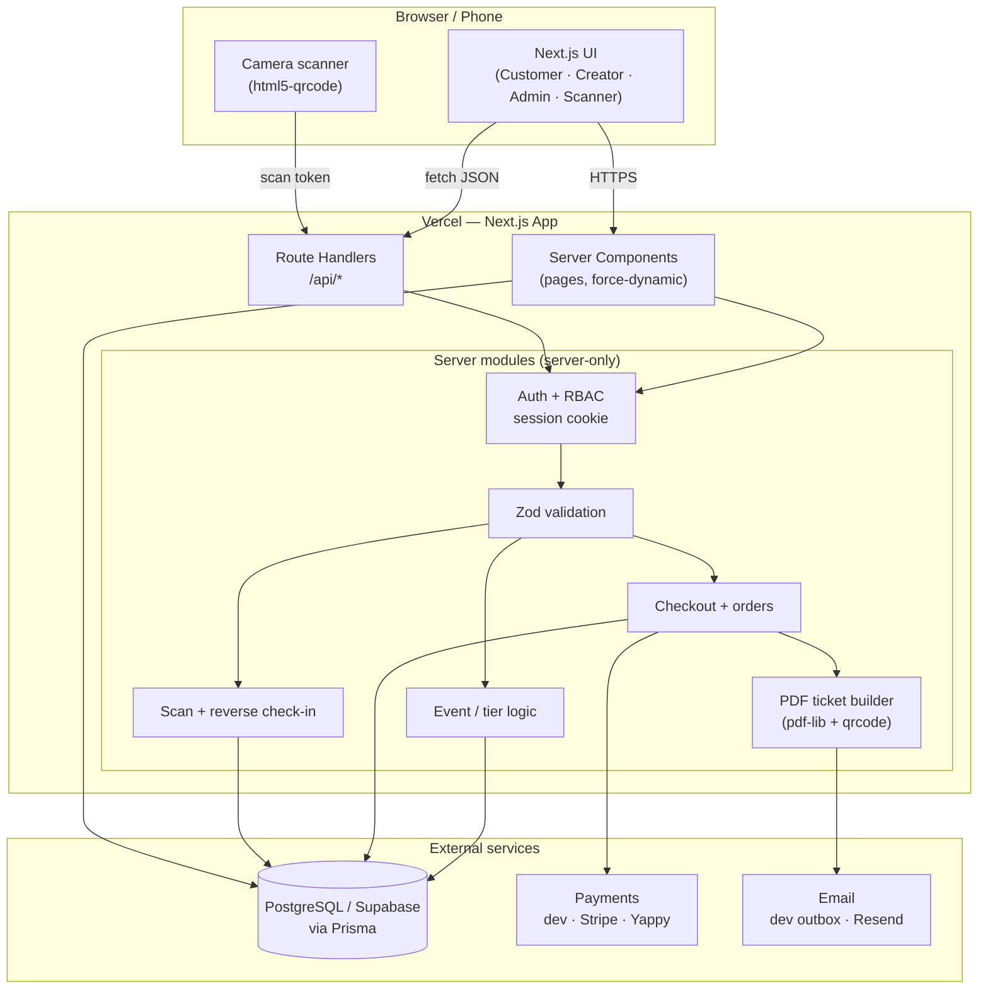
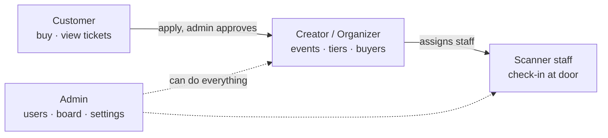
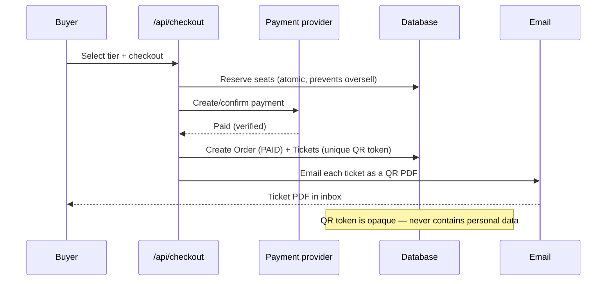
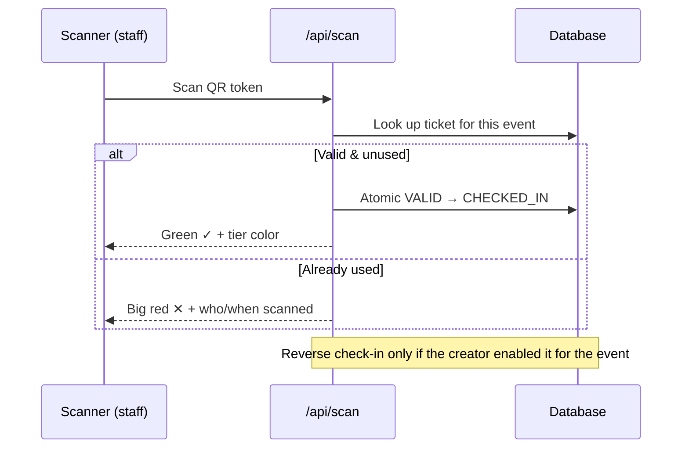

# S27 Events — Website Architecture

A high-level map of how the S27 Events ticketing platform is built and how a
request flows from a browser all the way to the database and back.

## Tech stack

| Layer      | Technology                                                        |
| ---------- | ----------------------------------------------------------------- |
| Framework  | Next.js 15 (App Router) + React 19 + TypeScript                   |
| Styling    | Tailwind CSS v3, framer-motion                                    |
| Data       | PostgreSQL (Supabase in production) via Prisma ORM                |
| Auth       | Custom session: bcrypt + HMAC-signed httpOnly cookie             |
| Validation | Zod (server-side on every mutation)                               |
| Payments   | Provider-agnostic (dev / Stripe / Yappy)                          |
| Email      | Provider-agnostic (dev outbox / Resend) — sends the QR PDF ticket |
| Tickets    | `qrcode` + `pdf-lib` (PDF), `html5-qrcode` (camera scanner)       |
| Hosting    | Vercel (app) + Supabase (database)                                |

## System diagram

## Roles (RBAC)

## Purchase → ticket flow

## Check-in flow

## Key data models

- **User** — role (CUSTOMER / CREATOR / ADMIN), creator approval status.
- **Event** — details, capacity, commission (fixed or %), consent form,
  ticket styling, `allowReverseCheckIn`, refund/transfer policy.
- **TicketTier** — price, quantity, per-order limit, optional password, scanner color.
- **Order / OrderItem** — payment status, totals; issued only after verified payment.
- **Ticket** — unique `qrToken` (no PII), status, check-in metadata.
- **CheckInLog** — every scan (valid, duplicate, reversed) for audit.
- **StaffAssignment** — who may scan an event (and reverse, if allowed).
- **BoardMember** — Senior 2027 executive board shown on the homepage (admin-managed).
- **AuditLog / PlatformSetting** — admin actions and platform fees.
